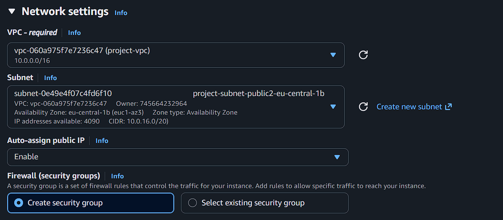
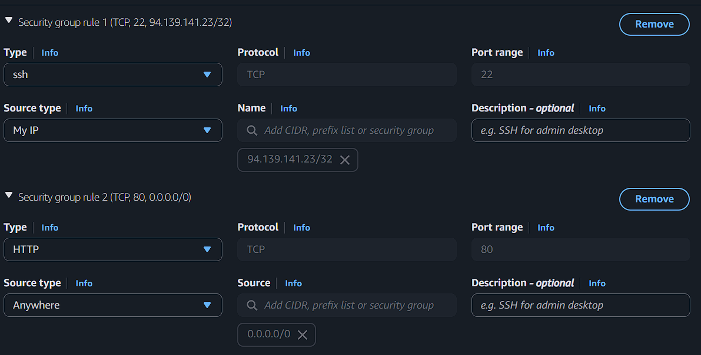
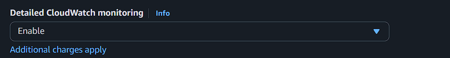
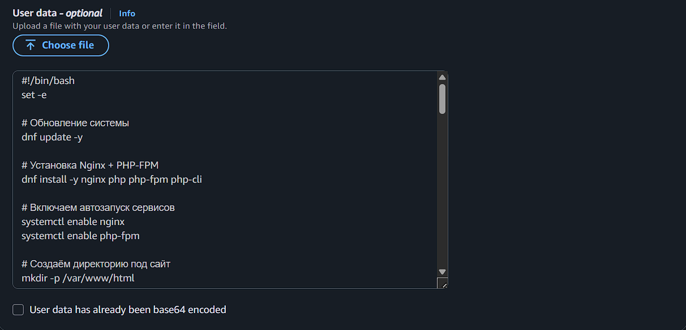
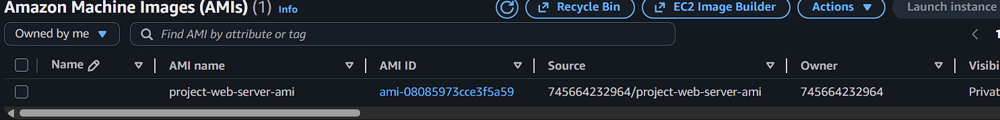
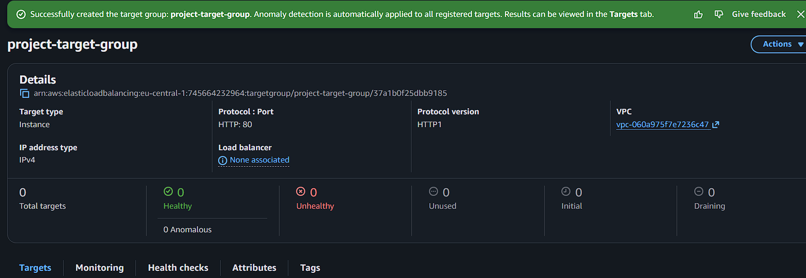
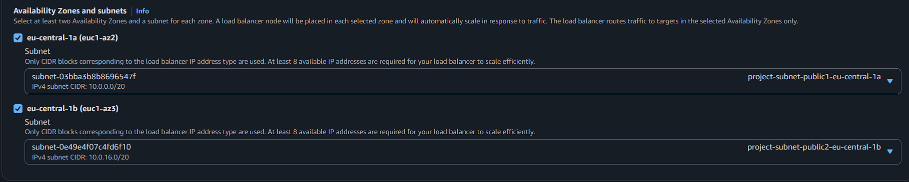
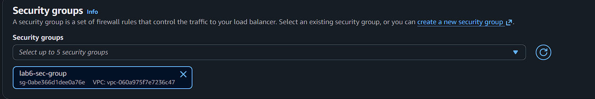

# Лабораторная работа №6. Балансирование нагрузки в облаке и авто-масштабирование
Выполнил: Алексеев Сергей  
Группа: IA-2303
## Цель работы

Закрепить навыки работы с AWS EC2, Elastic Load Balancer, Auto Scaling и CloudWatch, создав отказоустойчивую и автоматически масштабируемую архитектуру.

### Шаг 1. Создание VPC и подсетей

1. Создайте VPC (если уже есть — используйте существующую):
2. Создайте _2 публичные подсети_ и _2 приватные подсети_ в _разных зонах доступности_ (например, `us-east-1a` и `us-east-1b`):
   1. CIDR-блок: `10.0.1.0/24` и `10.0.2.0/24`
3. Создайте Internet Gateway и прикрепите его к VPC.
4. В Route Table пропишите маршрут для публичных подсетей:
   - Destination: `0.0.0.0/0` → Target: Internet Gateway

> Я буду использовать VPC и 5 лабораторной работы

### Шаг 2. Создание и настройка виртуальной машины

1. Запусите виртуальную машину в созданной подсети:

   1. AMI: `Amazon Linux 2`
   2. Тип: `t3.micro`
   3. В настройках сети выберите созданную VPC и подсеть.
      1. _Не забудьте назначить публичный IP-адрес_ (Enable auto-assign public IP).
      
   4. В настройках безопасности создайте новую группу безопасности с правилами:

      - Входящие правила:

        - SSH (порт 22) — источник: ваш IP
        - HTTP (порт 80) — источник: 0.0.0.0/0
        
      - Исходящие правила:
        - Все трафики — источник: 0.0.0.0/0
        
    5. В `Advanced Details` -> `Detailed CloudWatch monitoring` выберите `Enable`. Это позволит собирать дополнительные метрики для Auto Scaling.   
    

    6. В настройках `UserData` укажите следующий скрипт [init.sh](./script/init.sh), который установит, запустит nginx.
    

2. Дождитесь, пока `Status Checks` виртуальной машины станут зелёными (`3/3 checks passed`).

3. Убедитесь, что веб-сервер работает, подключившись к публичному IP-адресу виртуальной машины через браузер (_развертывание сервера может занять до 5 минут_).

### Шаг 3. Создание AMI

1. В EC2 выберите `Instance` → `Actions` → `Image and templates` → `Create image`.
2. Назовите AMI, например: `project-web-server-ami`.
3. Дождитесь появления AMI в разделе AMIs.

> Что такое image и чем он отличается от snapshot? Какие есть варианты использования AMI?
- **Image** это полноценный образ вирутальной машины, который содержит OS, пакеты, конфиги, а **Snapshot** это резервная копия EBS-диска в любом состоянии, снэпшот не содержит информацию об OS, метаданные
- **Варианты использования AMI**: Запуск EC2 инстансов, автоматическое масштабирование, миграция между регионами, Backup и Disaster Recovery

### Шаг 4. Создание Launch Template

На основе Launch Template в дальнейшем будет создаваться Auto Scaling Group, то есть подниматься новые инстансы по шаблону.

1. В разделе EC2 выберите `Launch Templates` → `Create launch template`.
2. Укажите следующие параметры:
   1. Название: `project-launch-template`
   2. AMI: выберите созданную ранее AMI (`My AMIs` -> `project-web-server-ami`).
   
   3. Тип инстанса: `t3.micro`.
   4. Security groups: выберите ту же группу безопасности, что и для виртуальной машины.
   
   5. Нажмите `Create launch template`.
   6. В разделе `Advanced details` -> `Detailed CloudWatch monitoring` выберите `Enable`. Это позволит собирать дополнительные метрики для Auto Scaling.
    

### Шаг 5. Создание Target Group

1. В разделе EC2 выберите `Target Groups` → `Create target group`.
2. Укажите следующие параметры:

   1. Название: `project-target-group`
   2. Тип: `Instances`
   3. Протокол: `HTTP`
   4. Порт: `80`
   5. VPC: выберите созданную VPC
    
3. Нажмите `Next` -> `Next`, затем `Create target group`.

> Зачем необходим и какую роль выполняет Target Group?
- **Target Group** - это ключевой компонент в AWS Elastic Load Balancing. Именно он определяет куда именно балансировщик будет отправлять трафик.

### Шаг 6. Создание Application Load Balancer

1. В разделе EC2 выберите `Load Balancers` → `Create Load Balancer` → `Application Load Balancer`.
2. Укажите следующие параметры:
   1. Название: `project-alb`
   2. Scheme: `Internet-facing`.
      > В чем разница между Internet-facing и Internal?
      - **Internet-facing**: балансировщик который доступен из интернета, имеет публичный IP, мпожет принимать трафик откуда угодно, включая внешних пользователей.
      - **Internal**: внутренний балансировщик, доступный только внутри VPC и не имеет публичного IP.

   3. Subnets: выберите созданные 2 публичные подсети.
   
   4. Security Groups: выберите ту же группу безопасности, что и для виртуальной машины.
   
   5. Listener: протокол `HTTP`, порт `80`.
   6. Default action: выберите созданную Target Group `project-target-group`.
   
      > Что такое Default action и какие есть типы Default action?
      - **Default action** - это действие в правилах *load balancer*, которое выполняется по умолчанию, если ни одно из других правил не сработало.
      1. **Forward** - *load balancer* направляет трафик в определённую Target Group.
      2. **Fixed-response** - *load balancer* озвращает заранее определённый HTTP-ответ: *2xx / 3xx / 4xx / 5xx*; bdoy: *plain text, JSON, HTML*.
      3. **Redirect** - *load balancer* может перенаправлять запрос на другой URL или протокол.
      4. **Authenticate** (только ALB) - ALB может выполнять аутентификацию перед передачей запроса: Cognito, OIDC (Google, GitHub).
   7. Нажмите `Create load balancer`.
3. Перейдите в раздел `Resource map` и убедитесь что существуют связи между `Listeners`, `Rules` и `Target groups`.

жду овтета от авс
