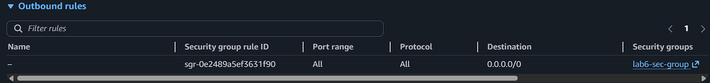
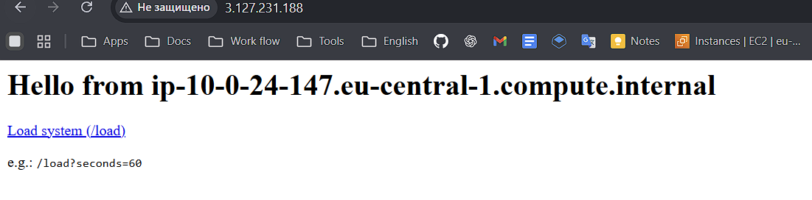
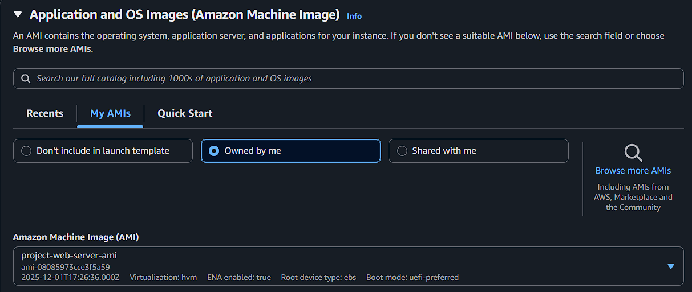
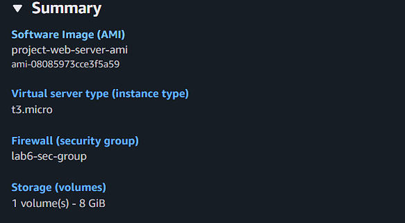
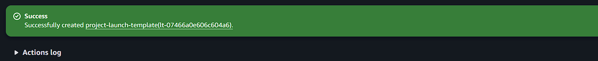
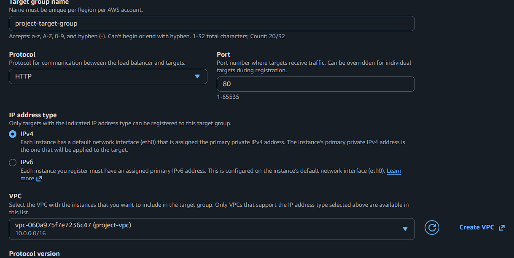
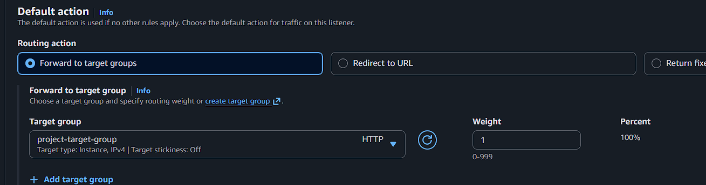
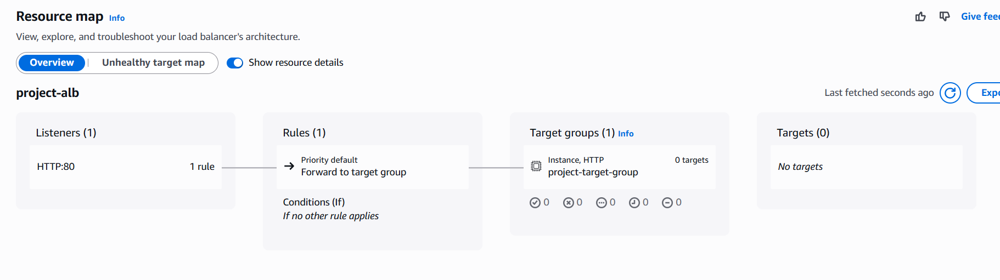
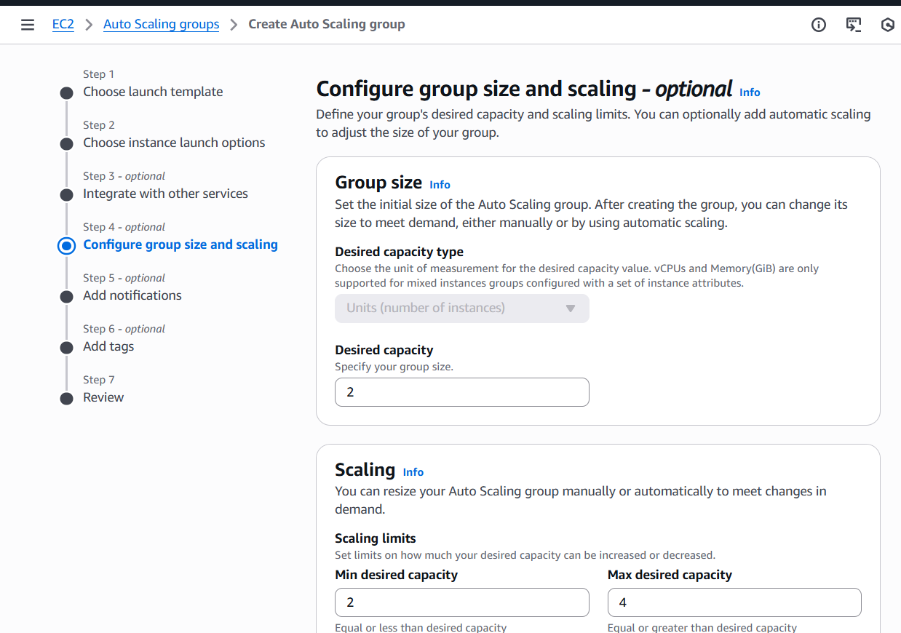
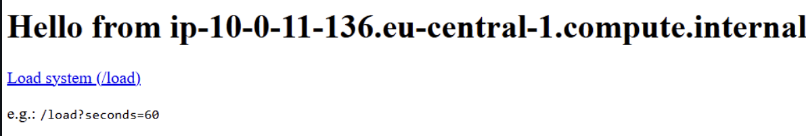

# Лабораторная работа №6. Балансирование нагрузки в облаке и авто-масштабирование
Выполнил: Алексеев Сергей  
Группа: IA-2303
## Цель работы

Закрепить навыки работы с AWS EC2, Elastic Load Balancer, Auto Scaling и CloudWatch, создав отказоустойчивую и автоматически масштабируемую архитектуру.

### Шаг 1. Создание VPC и подсетей

1. Создайте VPC (если уже есть — используйте существующую):
2. Создайте _2 публичные подсети_ и _2 приватные подсети_ в _разных зонах доступности_ (например, `us-east-1a` и `us-east-1b`):
   1. CIDR-блок: `10.0.1.0/24` и `10.0.2.0/24`
3. Создайте Internet Gateway и прикрепите его к VPC.
4. В Route Table пропишите маршрут для публичных подсетей:
   - Destination: `0.0.0.0/0` → Target: Internet Gateway

> Я буду использовать VPC и 5 лабораторной работы

### Шаг 2. Создание и настройка виртуальной машины

1. Запусите виртуальную машину в созданной подсети:

   1. AMI: `Amazon Linux 2`
   2. Тип: `t3.micro`
   3. В настройках сети выберите созданную VPC и подсеть.
      1. _Не забудьте назначить публичный IP-адрес_ (Enable auto-assign public IP).
      
   4. В настройках безопасности создайте новую группу безопасности с правилами:

      - Входящие правила:

        - SSH (порт 22) — источник: ваш IP
        - HTTP (порт 80) — источник: 0.0.0.0/0
        
      - Исходящие правила:
        - Все трафики — источник: 0.0.0.0/0
        
    5. В `Advanced Details` -> `Detailed CloudWatch monitoring` выберите `Enable`. Это позволит собирать дополнительные метрики для Auto Scaling.   
    

    6. В настройках `UserData` укажите следующий скрипт [init.sh](./script/init.sh), который установит, запустит nginx.
    

2. Дождитесь, пока `Status Checks` виртуальной машины станут зелёными (`3/3 checks passed`).

3. Убедитесь, что веб-сервер работает, подключившись к публичному IP-адресу виртуальной машины через браузер (_развертывание сервера может занять до 5 минут_).

### Шаг 3. Создание AMI

1. В EC2 выберите `Instance` → `Actions` → `images/Image and templates` → `Create images/image`.
2. Назовите AMI, например: `project-web-server-ami`.
3. Дождитесь появления AMI в разделе AMIs.

> Что такое images/image и чем он отличается от snapshot? Какие есть варианты использования AMI?
- **images/Image** это полноценный образ вирутальной машины, который содержит OS, пакеты, конфиги, а **Snapshot** это резервная копия EBS-диска в любом состоянии, снэпшот не содержит информацию об OS, метаданные
- **Варианты использования AMI**: Запуск EC2 инстансов, автоматическое масштабирование, миграция между регионами, Backup и Disaster Recovery

### Шаг 4. Создание Launch Template

На основе Launch Template в дальнейшем будет создаваться Auto Scaling Group, то есть подниматься новые инстансы по шаблону.

1. В разделе EC2 выберите `Launch Templates` → `Create launch template`.
2. Укажите следующие параметры:
   1. Название: `project-launch-template`
   2. AMI: выберите созданную ранее AMI (`My AMIs` -> `project-web-server-ami`).
   
   3. Тип инстанса: `t3.micro`.
   4. Security groups: выберите ту же группу безопасности, что и для виртуальной машины.
   
   5. Нажмите `Create launch template`.
   6. В разделе `Advanced details` -> `Detailed CloudWatch monitoring` выберите `Enable`. Это позволит собирать дополнительные метрики для Auto Scaling.
    

### Шаг 5. Создание Target Group

1. В разделе EC2 выберите `Target Groups` → `Create target group`.
2. Укажите следующие параметры:

   1. Название: `project-target-group`
   2. Тип: `Instances`
   3. Протокол: `HTTP`
   4. Порт: `80`
   5. VPC: выберите созданную VPC
    
3. Нажмите `Next` -> `Next`, затем `Create target group`.

> Зачем необходим и какую роль выполняет Target Group?
- **Target Group** - это ключевой компонент в AWS Elastic Load Balancing. Именно он определяет куда именно балансировщик будет отправлять трафик.

### Шаг 6. Создание Application Load Balancer

1. В разделе EC2 выберите `Load Balancers` → `Create Load Balancer` → `Application Load Balancer`.
2. Укажите следующие параметры:
   1. Название: `project-alb`
   2. Scheme: `Internet-facing`.
      > В чем разница между Internet-facing и Internal?
      - **Internet-facing**: балансировщик который доступен из интернета, имеет публичный IP, мпожет принимать трафик откуда угодно, включая внешних пользователей.
      - **Internal**: внутренний балансировщик, доступный только внутри VPC и не имеет публичного IP.

   3. Subnets: выберите созданные 2 публичные подсети.
   
   4. Security Groups: выберите ту же группу безопасности, что и для виртуальной машины.
   
   5. Listener: протокол `HTTP`, порт `80`.
   6. Default action: выберите созданную Target Group `project-target-group`.
   
      > Что такое Default action и какие есть типы Default action?
      - **Default action** - это действие в правилах *load balancer*, которое выполняется по умолчанию, если ни одно из других правил не сработало.
      1. **Forward** - *load balancer* направляет трафик в определённую Target Group.
      2. **Fixed-response** - *load balancer* озвращает заранее определённый HTTP-ответ: *2xx / 3xx / 4xx / 5xx*; bdoy: *plain text, JSON, HTML*.
      3. **Redirect** - *load balancer* может перенаправлять запрос на другой URL или протокол.
      4. **Authenticate** (только ALB) - ALB может выполнять аутентификацию перед передачей запроса: Cognito, OIDC (Google, GitHub).
   7. Нажмите `Create load balancer`.
3. Перейдите в раздел `Resource map` и убедитесь что существуют связи между `Listeners`, `Rules` и `Target groups`.

### Шаг 7. Создание Auto Scaling Group

1. В разделе EC2 выберите `Auto Scaling Groups` → `Create Auto Scaling group`.
2. Укажите следующие параметры:

   1. Название: `project-auto-scaling-group`
   2. Launch template: выберите созданный ранее Launch Template (`project-launch-template`).
   3. Перейдите в раздел `Choose instance launch options `.

      - В разделе`Network`: выберите созданную VPC и две приватные подсети.
      
      > Почему для Auto Scaling Group выбираются приватные подсети?
      - **ASG размещают в приватных подсетях**, чтобы backend-инстансы были скрыты от интернета, а трафик шёл только через Load Balancer
   4. Availability Zone distribution: выберите `Balanced best effort`.

      > Зачем нужна настройка: `Availability Zone distribution`?
      - Это механизм, который гарантирует, что наши инстансы будут равномерно распределены по нескольким зонам доступности, чтобы обеспечить отказоустойчивость.

   5. Перейдите в раздел `Integrate with other services` и выберите `Attach to an existing load balancer`, затем выберите созданную Target Group (`project-target-group`).
      - Таким образом мы добавляем AutoScaling Group в Target Group нашего Load Balancer-а.
   6. Перейдите в раздел `Configure group size and scaling` и укажите:

      1. Минимальное количество инстансов: `2`
      2. Максимальное количество инстансов: `4`
      3. Желаемое количество инстансов: `2`
      4. Укажите `Target tracking scaling policy` и настройте масштабирование по CPU (Average CPU utilization — `50%` / `Instance warm-up period` — `60 seconds`).
      
         > Что такое _Instance warm-up period_ и зачем он нужен?
         - **Instance warm-up period** - это параметр в Auto Scaling Group, задающий время, которое новая EC2-инстанция считается разогревающейся после запуска, прежде чем её метрики начнут учитываться политиками масштабирования.

      5. В разделе `Additional settings` поставьте галочку на `Enable group metrics collection within CloudWatch`, чтобы собирать метрики Auto Scaling Group в CloudWatch. _Этот пункт позволит нам отслеживать состояние группы и её производительность_.

   7. Перейдите в раздел `Review` и нажмите `Create Auto Scaling group`.
   

### Шаг 8. Тестирование Application Load Balancer

1. Перейдите в раздел EC2 -> `Load Balancers`, выберите созданный Load Balancer и скопируйте его DNS-имя.
2. Вставьте DNS-имя в браузер и убедитесь, что вы видите страницу веб-сервера.
3. Обновите страницу несколько раз и посмотрите на IP-адреса в ответах.

- Обновив страниуц несколько раз нас перенаправляет на втроой инстанс

> Какие IP-адреса вы видите и почему?
При обновлении страницы появляются 2 IP-адреса — это IP двух Healthy EC2-инстансов.
Потому что: желаемое количество инстансов (desired capacity) = 2, ASG создала 2 инстанса, ALB распределяет запросы только между теми, что Healthy

### Шаг 9. Тестирование Auto Scaling

1. Перейдите в CloudWatch -> `Alarms`, у вас должны быть созданы автоматические оповещения для Auto Scaling Group.
2. Выберите одно из оповещений (например, `TargetTracking-XX-AlarmHigh-...`), откройте и посмотрите на график CPU Utilization. На данный момент график должен быть низким (около 0-1%).
3. Перейдите в браузер и откройте 6-7 вкладок со следующим адресом:
4. Вернитесь в CloudWatch и посмотрите на график CPU Utilization. Через несколько минут вы должны увидеть рост нагрузки.
5. Подождите 2-3 минуты, пока CloudWatch не зафиксирует высокую нагрузку и не создаст `Alarm` (будет показано красным цветом).
6. Перейдите в раздел `EC2` -> `Instances` и посмотрите на количество запущенных инстансов.

   
   > Какую роль в этом процессе сыграл Auto Scaling?
   - Auto Scaling в этом процессе выполняет центральную роль: он автоматически реагирует на рост нагрузки и масштабирует нашу инфраструктуру без нашего участия.
